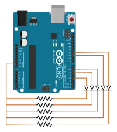
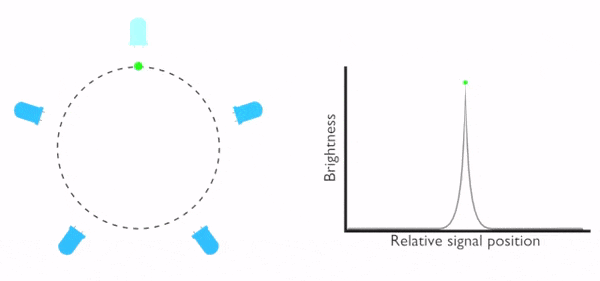

# Flux Capacitor / LED Chaser (Arduino)

This repo contains code for implementing a simple LED chaser using an Arduino (or similar microcontroller), made for friend creating a replica of the [flux capacitor](https://www.youtube.com/watch?v=VcZe8_RZO8c) from the movie [Back to the Future](https://en.wikipedia.org/wiki/Back_to_the_Future).

  

## Code

There are two code files, one for a very simple LED chaser and one which uses [PWM](https://learn.sparkfun.com/tutorials/pulse-width-modulation), allowing for fading between the LEDs. The animations below show the difference between the two effects:

  

  

The code for each effect is found in the **simple_sequence** or **fade_sequence** folders of this repo. In either code file, there are variables at the top of the files that can be modified to change the timing/behavior. Importantly, the pin numbering must be set according to how you have the circuit wired up. In both files, this is represented using the `PIN_NUMBERS` variable at the very top of the file. Each file has 5 pin numbers by default, but this can be changed to any number of pins, depending on your circuit.

## Circuit

Each of the LEDs that you're lighting up is assumed to be connected directly to the Arduino. In order to protect the Arduino/LED, a resistor should be included to limit the total current for each LED (the exact resistor value will vary based on your circuit voltage/LED, but aiming for between 220 and 1000 ohms is a safe bet for small LEDs).

Since the simple sequence only ever has a single LED lit at any moment, you can get away with a single *shared* resistor as follows:

  

However, if you use the fading sequence, you'll likely want one resistor per LED as well as making sure to use PWM pins for each LED to enable the fading effect:

  

Lastly, if you are actually making a circuit for a flux capacitor, you would need to wire 3 LEDs in parallel on each pin (instead of just one, as depicted in the diagrams above), to account for the 3 'arms' of the flux capacitor that light up in parallel. You may also want to reduce the resistor value to account for the tripled current.

Note: Having 3 LEDs per pin may exceed the Arduino's maximum current output on the pins. This may allow you to get away without needing resistors, though it could come at the cost of slowly damaging the Arduino and/or LEDs! Alternatively, if you need *more* current to properly drive all the LEDs, you may want to use a [transistor circuit](https://learn.sparkfun.com/tutorials/transistors/applications-i-switches) to switch the LEDs on/off.

## Modifying the fade effect

The fade effect models the LEDs as though they are equally spaced on a circle, with a *signal* that constantly rotates around the circle, lighting up each LED as it passes. The animation below illustrates the idea of a signal (green circle) that rotates by each LED, lighting it up. The graph on the right shows the activation pattern for the top-most LED based on the signal position:

  

The pattern used to light up the LEDs can be modified to give different effects, though the default is simply to fade the LEDs in/out as the signal passes each LED. You could, for example, have the LEDs continue to blink/echo as the signal passes by using [sinusoidal](https://www.sparkfun.com/tutorials/329) activation patterns. If you'd like to modify this behavior, it is controlled by the `led_activation_pattern` function of the fading sequence code.